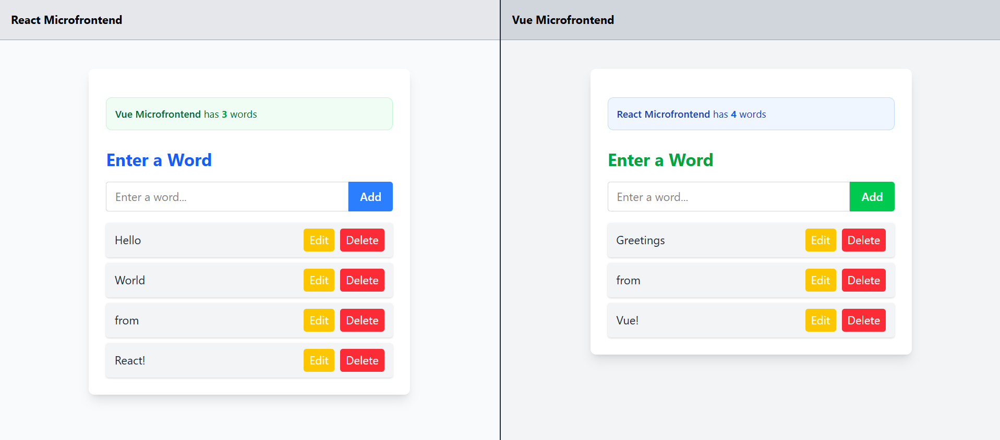

# Microfrontend Architecture Demo

A demonstration of microfrontend architecture using **React** and **Vue** with **Module Federation** and cross-application communication via custom browser events.

## Live Demo
https://microfrontends-demo-gamma.vercel.app/



## Project Structure

```
desarrollo/
├── host-app/          # React host application (loads microfrontends)
├── reactmf-app/       # React microfrontend (word list app)
└── vuemf-app/         # Vue microfrontend (word list app)
```

## Architecture

- **host-app**: Main React application that loads and orchestrates both microfrontends
- **reactmf-app**: Standalone React application exposed as a microfrontend via Module Federation
- **vuemf-app**: Standalone Vue application exposed as a microfrontend via Module Federation


## Strengths of this architecture

- Independent deploys: each frontend and each backend can be released separately without redeploying the whole system.
- Technology independence: different teams can choose the stack that fits their needs (React or Vue on the frontend; Node or Go on the backend).
- Bounded contexts and data ownership: microbackends own their data (their own Postgres instances in the example), reducing coupling and enabling different scaling strategies.
- Reduced blast radius: bugs or heavy load in one microservice or microfrontend do not necessarily affect others.
- Faster onboarding & development: smaller codebases allow focused work and faster local feedback loops.


